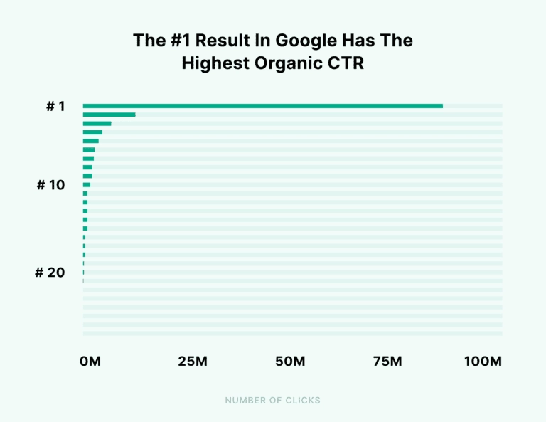

## I. Frontend Tech Stack

### Next.js

프론트엔드 개발 환경으로 Next.js를 도입한 이유는 **SEO를 높이기 위함**입니다.

바카티오에서 운영 중인 Fine Stay 서비스는 Next.js를 활용해 개발되었습니다. 다만 실제 서비스에서 사용된다는 이유만으로 Next.js를 도입하지는 않았습니다. 개인적으로 개발자는 기술을 도입할 때 서비스의 목적에 따라 선택해야 한다고 생각하기 때문입니다

Fine Stay는 숙박 예약 서비스입니다. 그러나 숙박 예약 서비스는 Fine Stay만 존재하는 것이 아니라, 다양한 서비스가 존재합니다.

이 때문에 사용자가 숙박 예약을 검색하면 검색 엔진은 내부적으로 순위를 매겨 다양한 검색 결과를 제공합니다. 그러나 SEO가 낮아 순위가 떨어지고 검색 결과 목록의 하위에 위치하게 되면, 사용자들이 Fine Stay 서비스를 보지 못하거나 클릭하지 않을 수 있습니다.

실제로 BACKLINKO에서 400만 건의 CTR을 분석한 통계를 보면, 자연 검색 결과(Organic Search Result) 1위를 제외하면 CTR이 급격히 감소하는 것을 확인할 수 있습니다.

 

 

다만 SEO를 높이기 위해서는 개발 영역뿐만 아니라 마케팅, 브랜딩 등 다양한 팀과 협업을 통해 이루어져야 합니다.

그러나 Fine Stay를 클론 코딩하는 목적은 제가 직접 서비스를 운영하지는 않지만 실제 서비스에서 발생할 수 있는 다양한 문제와 경험을 마주하고 이를 개선하기 위함이기 때문에, 개발 영역에서 SEO를 높이는 방법만 진행할 것입니다.

그렇기 때문에 프론트엔드 개발 환경을 CSR 기반인 React, Vue, Angular보다는 다양한 웹 렌더링을 지원하는 Next.js를 활용하는 것이 SEO를 높일 수 있다고 판단하여 도입했습니다.

 

### TanStack Query

TanStack Query를 도입한 이유는 빈번하게 변경되는 **서버 상태(Server State)를 효율적으로 관리**하기 위함입니다.

숙박 예약 서비스의 경우 등록된 숙박 시설 정보를 서버로부터 자주 요청해야 합니다. 그러나 응답 헤더에 Cache-Control을 설정하여 브라우저 캐시로 관리하면, 캐시의 유효 기간이 만료되기 전까지는 새로운 데이터로 즉시 갱신하기 어렵습니다.

첫 번째로, Cache-Control 응답 헤더가 설정된 응답 데이터는 브라우저가 지정된 유효 기간에 따라 디스크(Disk) 또는 메모리(Memory)에 저장되어 캐시로 관리됩니다. 그러나 숙박 시설 정보는 변경이 잦기 때문에 페이지 이용 중에는 캐시를 재사용하되, 재접속 시에는 새로운 데이터로 갱신될 필요가 있어, 장기간 유지되는 캐시가 아닌 휘발성으로 관리될 필요가 있습니다. 하지만 캐시의 저장 위치와 방식은 브라우저의 구현에 따라 결정되므로 개발자가 직접 제어할 수 없습니다.

두 번째로, no-cache 또는 no-store를 활용해 HTTP 캐시를 제어할 경우 최신 데이터를 보장할 수는 있지만, 사용자가 페이지를 이동한 뒤 다시 돌아왔을 때 이전에 보던 데이터가 유지되지 않고 새로 갱신된다는 문제가 있습니다.

이처럼 자주 요청이 발생하는 숙박 시설 정보는 장기간 유지되는 캐시가 아닌 휘발성으로 관리될 필요가 있습니다. 이를 단순 상태로 관리할 수도 있지만, 이 경우 모든 로직을 직접 구현해야 하므로 복잡해질 수 있다고 판단하여 서버 상태 관리 도입을 고려했습니다.

그 중 SWR과 TanStack Query를 고려했지만, TanStack Query가 SWR에 비해 비교적 무겁기는 하지만 다양한 기능을 제공하면서, 전용 개발자 도구를 제공하여 서버 상태들을 시각적으로 즉시 확인할 수 있어 번들 크기가 올라가는 것에 비해 장정이 더 있다고 판단하여 선택하게 되었습니다.

 

## II. Backend Tech Stack

### Node.js / Express.js

백엔드 개발 환경으로 Express.js를 도입한 이유는 **프론트엔드 <-> 백엔드 개발 환경을 분리**하기 위함입니다.

한 번도 활용해보지 않아 상세한 내용을 알지 못하지만, Next.js는 내부적으로 API를 구현할 수 있는 기능을 제공합니다. 다만 Next.js를 통해 프론트엔드와 백엔드 로직을 하나의 프로젝트 내에서 구축하게 되면 각 개발 환경을 분리하여 개발하기가 복잡해지고, 배포 시에도 전체 프로젝트 기준으로 진행되기 때문에 서로 다른 영역을 수정하더라도 상관없는 부분까지 재빌드되어 빌드 시간이 증가하는 문제점이 있습니다.

따라서 Node.js를 활용하여 서버를 구축하되, 라우팅･요청 처리 및 응답 관리를 Node.js만으로 직접 구현하기에는 복잡하기 때문에 이러한 기능을 간편하게 사용할 수 있도록 제공하는 Express.js 프레임워클르 통해 서버를 구축하기로 결정했습니다.

 

### MySQL / Sequelize ORM

 

### Redis

이번 프로젝트에서는 토큰 기반 인증(Token-based Authentication) 방식을 사용하는데, 이때 **Refresh Token을 효율적으로 관리하기 위해 Redis를 도입**했습니다.

토큰 기반 인증 방식에서 Access Token과 Refresh Token을 반드시 함께 사용해야 하는 것은 아닙니다. 다만 하나의 토큰으로만 사용할 경우 토큰이 탈취되었을 때 악용될 수 있기 때문에, 일반적으로는 유효 기간이 짧은 Access Token과 이를 재발급하기 위한 Refresh Token을 함께 운용합니다.

이때 Refresh Token은 클라이언트 저장소에도 저장되지만, 서버 측 저장소에도 함께 보관하여 클라이언트가 전달한 Refresh Token이 유효한지 검증하는 데 사용됩니다.

그러만 Refresh Token을 서버 메모리에 저장해 관리한다면, 서버가 재시작되거나 여러 서버로 확장되는 환경에서 기존 토큰 정보를 유지할 수 없습니다. 따라서 Refresh Token의 만료 기간이 남아 있더라도 정상적으로 검증하지 못하는 문제가 발생할 수 있습니다.

반면 DB에 저장하면 서버가 재시작되더라도 데이터를 유지할 수 있지만, Refresh Token처럼 자주 조회되고 만료 처리가 중요한 데이터는 메모리 기반 저장소에 비해 상대적으로 비효율적일 수 있습니다.

Redis는 메모리 기반 저장소이기 때문에 조회 속도가 빠르고, 만료 시간을 쉽게 관리할 수 있습니다. 따라서 Refresh Token처럼 빠른 조회와 만료 관리가 중요한 데이터를 저장하기에는 적합하다고 판단하여 도입했습니다.

 

## III. Deployment

### AWS S3 / CloudFront

 

### AWS EC2

 

### AWS RDS

 
